# Diagrama UML Completo - Sistema ADA LocateCar

Este diagrama mostra as camadas do sistema implementado com todas as funcionalidades finais, incluindo validações de entrada, interface completa e persistência em memória.

```mermaid
classDiagram
    %% =========================
    %% CAMADA DE DOMÍNIO
    %% =========================
    class TipoVeiculo {
        <<enumeration>>
        PEQUENO(100.0)
        MEDIO(150.0)
        SUV(200.0)
        -valorDiaria : double
        +getValorDiaria() double
        +calcularAluguel(dias:int) double
    }

    class Veiculo {
        -placa : String
        -nome : String
        -tipo : TipoVeiculo
        -disponivel : boolean
        +Veiculo(placa:String, nome:String, tipo:TipoVeiculo)
        +getPlaca() String
        +getNome() String
        +getTipo() TipoVeiculo
        +isDisponivel() boolean
        +setDisponivel(disponivel:boolean) void
        +setTipoVeiculo(tipo:TipoVeiculo) void
        +getIdentificador() String
        +equals(Object) boolean
        +hashCode() int
        +toString() String
    }

    class Cliente {
        <<abstract>>
        -documento : String
        -nome : String
        +getDocumento() String
        +setDocumento(documento:String) void
        +getNome() String
        +setNome(nome:String) void
        +calcularDesconto(dias:int) double*
    }

    class PessoaFisica {
        -cpf : String
        +PessoaFisica(cpf:String, nome:String)
        +getCpf() String
        +calcularDesconto(dias:int) double
    }

    class PessoaJuridica {
        -cnpj : String
        +PessoaJuridica(cnpj:String, nome:String)
        +getCnpj() String
        +calcularDesconto(dias:int) double
    }

    class Aluguel {
        -id : String
        -cliente : Cliente
        -veiculo : Veiculo
        -dataHoraRetirada : LocalDateTime
        -dataHoraDevolucao : LocalDateTime
        -localRetirada : String
        -localDevolucao : String
        -valorTotal : BigDecimal
        -ativo : boolean
        +Aluguel(id:String, cliente:Cliente, veiculo:Veiculo, retirada:LocalDateTime, localRetirada:String)
        +getId() String
        +getCliente() Cliente
        +getVeiculo() Veiculo
        +getDataHoraRetirada() LocalDateTime
        +getDataHoraDevolucao() LocalDateTime
        +getLocalRetirada() String
        +getLocalDevolucao() String
        +getValorTotal() BigDecimal
        +isAtivo() boolean
        +finalizar(devolucao:LocalDateTime, localDevolucao:String) void
        -calcularValorTotal() BigDecimal
        -calcularDias() int
    }

    %% =========================
    %% CAMADA DE REPOSITÓRIOS (IMPLEMENTAÇÕES CONCRETAS)
    %% =========================
    class ClienteRepository {
        -clienteList : List~Cliente~
        +ClienteRepository(clienteList:List~Cliente~)
        +salvar(cliente:Cliente) void
        +listarTodos() List~Cliente~
        +buscarPorNomeParcial(termo:String) List~Cliente~
        +buscarPorDocumento(documento:String) Optional~Cliente~
        +getIdentificador(cliente:Cliente) String
    }

    class VeiculoRepository {
        -veiculoList : List~Veiculo~
        +VeiculoRepository(veiculoList:List~Veiculo~)
        +salvar(veiculo:Veiculo) void
        +buscarPorPlaca(placa:String) Optional~Veiculo~
        +listarTodos() List~Veiculo~
        +buscarPorNomeParcial(termo:String) List~Veiculo~
        +buscarDisponiveis() List~Veiculo~
    }

    class AluguelRepository {
        -aluguelList : List~Aluguel~
        +AluguelRepository(aluguelList:List~Aluguel~)
        +salvar(aluguel:Aluguel) void
        +buscarPorId(id:String) Optional~Aluguel~
        +listarTodos() List~Aluguel~
        +buscarAtivos() List~Aluguel~
        +buscarPorCliente(documento:String) List~Aluguel~
        +buscarPorVeiculo(placa:String) List~Aluguel~
    }

    %% =========================
    %% CAMADA DE SERVIÇOS (REGRAS DE NEGÓCIO)
    %% =========================
    class ClienteService {
        -repository : ClienteRepository
        +ClienteService(repository:ClienteRepository)
        +cadastrarCliente(cliente:Cliente) void
        +buscarPorNome(nome:String) List~Cliente~
        +listarTodos() List~Cliente~
    }

    class VeiculoService {
        -repository : VeiculoRepository
        +VeiculoService(repository:VeiculoRepository)
        +cadastrarVeiculo(veiculo:Veiculo) void
        +buscarPorPlaca(placa:String) Optional~Veiculo~
        +listarTodos() List~Veiculo~
        +listarDisponiveis() List~Veiculo~
        +buscarPorNome(nome:String) List~Veiculo~
        +alterarVeiculo(veiculo:Veiculo) void
    }

    class AluguelService {
        -aluguelRepository : AluguelRepository
        -clienteRepository : ClienteRepository
        -veiculoRepository : VeiculoRepository
        +AluguelService(aluguelRepo:AluguelRepository, clienteRepo:ClienteRepository, veiculoRepo:VeiculoRepository)
        +alugar(documento:String, placa:String, retirada:LocalDateTime, localRetirada:String) Aluguel
        +devolver(aluguelId:String, devolucao:LocalDateTime, localDevolucao:String) void
        +listarAtivos() List~Aluguel~
        +listarPorCliente(documento:String) List~Aluguel~
        +listarPorVeiculo(placa:String) List~Aluguel~
        +listarTodos() List~Aluguel~
    }

    %% =========================
    %% CAMADA DE APRESENTAÇÃO (INTERFACE)
    %% =========================
    class MenuPrincipal {
        -clienteService : ClienteService
        -veiculoService : VeiculoService
        -aluguelService : AluguelService
        -scanner : Scanner
        +MenuPrincipal(clienteService:ClienteService, veiculoService:VeiculoService, aluguelService:AluguelService)
        +start() void
        -exibirMenuPrincipal() void
        -lerOpcao() int
    }

    class MenuCliente {
        -clienteService : ClienteService
        -scanner : Scanner
        +MenuCliente(clienteService:ClienteService, scanner:Scanner)
        +iniciar() void
        -exibirMenu() void
        -cadastrarCliente() void
        -listarClientes() void
        -buscarClientePorNome() void
        -lerOpcao() int
    }

    class MenuVeiculo {
        -veiculoService : VeiculoService
        -scanner : Scanner
        +MenuVeiculo(veiculoService:VeiculoService, scanner:Scanner)
        +iniciar() void
        -exibirMenu() void
        -cadastrarVeiculo() void
        -listarVeiculos() void
        -listarDisponiveis() void
        -buscarVeiculoPorNome() void
        -lerOpcao() int
    }

    class MenuAluguel {
        -aluguelService : AluguelService
        -clienteService : ClienteService
        -veiculoService : VeiculoService
        -scanner : Scanner
        +MenuAluguel(aluguelService:AluguelService, clienteService:ClienteService, veiculoService:VeiculoService, scanner:Scanner)
        +iniciar() void
        -exibirMenu() void
        -alugarVeiculo() void
        -devolverVeiculo() void
        -listarAlugueisAtivos() void
        -listarTodosAlugueis() void
        -lerDataHoraDevolucao(dataRetirada:LocalDateTime) LocalDateTime
        -lerOpcao() int
    }

    class Main {
        +main(args:String[]) void
    }

    %% =========================
    %% RELACIONAMENTOS
    %% =========================
    
    %% Herança
    Cliente <|-- PessoaFisica
    Cliente <|-- PessoaJuridica

    %% Associações de domínio
    Aluguel --> Cliente : refere-se a
    Aluguel --> Veiculo : refere-se a
    Veiculo --> TipoVeiculo : possui

    %% Dependências: serviços usam repositórios
    ClienteService --> ClienteRepository : usa
    VeiculoService --> VeiculoRepository : usa
    AluguelService --> AluguelRepository : usa
    AluguelService --> ClienteRepository : consulta
    AluguelService --> VeiculoRepository : consulta

    %% Dependências: interface usa serviços
    MenuPrincipal --> ClienteService : usa
    MenuPrincipal --> VeiculoService : usa
    MenuPrincipal --> AluguelService : usa
    MenuPrincipal --> MenuCliente : cria
    MenuPrincipal --> MenuVeiculo : cria
    MenuPrincipal --> MenuAluguel : cria
    
    MenuCliente --> ClienteService : usa
    MenuVeiculo --> VeiculoService : usa
    MenuAluguel --> AluguelService : usa
    MenuAluguel --> ClienteService : usa
    MenuAluguel --> VeiculoService : usa

    %% Main inicializa tudo
    Main --> MenuPrincipal : cria
    Main --> ClienteService : cria
    Main --> VeiculoService : cria
    Main --> AluguelService : cria
    Main --> ClienteRepository : cria
    Main --> VeiculoRepository : cria
    Main --> AluguelRepository : cria
```

## 📋 Resumo das Funcionalidades Implementadas

### ✅ **Gestão Completa do Sistema:**
- **Camada de Domínio:** Entidades com validações e regras de negócio
- **Camada de Repositório:** Persistência em memória com operações CRUD
- **Camada de Serviço:** Validações e regras de negócio complexas  
- **Camada de Apresentação:** Interface de console completa e intuitiva

### 🎯 **Funcionalidades Principais:**

**📋 Gestão de Clientes:**
- Cadastro de Pessoa Física (CPF) e Jurídica (CNPJ)
- Listagem completa com tipo identificado
- Busca por nome parcial (case-insensitive)
- Validações de documento e dados obrigatórios

**🚗 Gestão de Veículos:**
- Cadastro com tipos e valores: PEQUENO (R$ 100), MEDIO (R$ 150), SUV (R$ 200)
- Controle de disponibilidade automático
- Listagem geral e apenas disponíveis
- Busca por nome/modelo
- Validação de placa única

**💰 Gestão de Aluguéis:**
- Processo de aluguel com cliente e veículo
- **Devolução com entrada opcional de data/hora**
- Validações temporais (não futura, não anterior à retirada)
- Cálculo automático de diárias e descontos
- Descontos: PF 5% (>5 dias), PJ 10% (>3 dias)
- Relatórios de aluguéis ativos e histórico

### 🔧 **Validações Implementadas:**

**⏰ Data/Hora de Devolução:**
- Formato obrigatório: `dd/MM/yyyy HH:mm`
- Entrada opcional (ENTER = agora)
- Não permite datas futuras
- Não permite datas anteriores à retirada
- Exemplos e instruções claras
- Tratamento de erro com opção de retry

**📊 Outras Validações:**
- Documentos únicos (CPF/CNPJ)
- Placas únicas de veículos
- Campos obrigatórios
- Veículos disponíveis para aluguel
- Aluguéis ativos para devolução

### 💾 **Arquitetura:**
- **Padrão Repository:** Abstração da persistência
- **Injeção de Dependência:** Services recebem repositórios
- **Separação de Responsabilidades:** Cada camada com função específica
- **Tratamento de Erros:** Try-catch com mensagens informativas
- **Optional:** Para métodos que podem não retornar resultado
