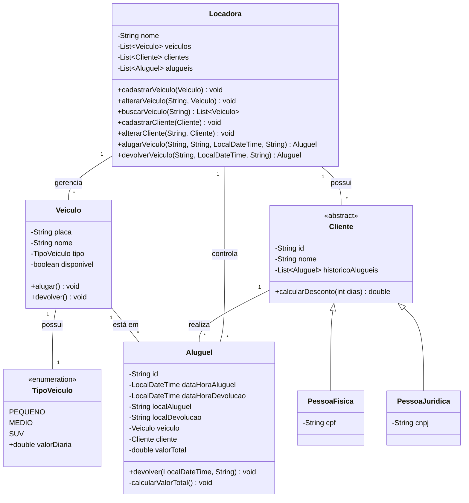

```mermaid
classDiagram
    %% ENUMS
    class TipoVeiculo {
        <<enumeration>>
        PEQUENO
        MEDIO
        SUV
        +double valorDiaria
    }

    %% CLASSES PRINCIPAIS
    class Veiculo {
        -String placa
        -String nome
        -TipoVeiculo tipo
        -boolean disponivel
        +alugar() void
        +devolver() void
    }

    class Cliente {
        <<abstract>>
        -String id
        -String nome
        -List~Aluguel~ historicoAlugueis
        +calcularDesconto(int dias) double
    }

    class PessoaFisica {
        -String cpf
    }

    class PessoaJuridica {
        -String cnpj
    }

    class Aluguel {
        -String id
        -LocalDateTime dataHoraAluguel
        -LocalDateTime dataHoraDevolucao
        -String localAluguel
        -String localDevolucao
        -Veiculo veiculo
        -Cliente cliente
        -double valorTotal
        +devolver(LocalDateTime, String) void
        -calcularValorTotal() void
    }

    class Locadora {
        -String nome
        -List~Veiculo~ veiculos
        -List~Cliente~ clientes
        -List~Aluguel~ alugueis
        +cadastrarVeiculo(Veiculo) void
        +alterarVeiculo(String, Veiculo) void
        +buscarVeiculo(String) List~Veiculo~
        +cadastrarCliente(Cliente) void
        +alterarCliente(String, Cliente) void
        +alugarVeiculo(String, String, LocalDateTime, String) Aluguel
        +devolverVeiculo(String, LocalDateTime, String) Aluguel
    }

    %% RELACIONAMENTOS
    Cliente <|-- PessoaFisica
    Cliente <|-- PessoaJuridica
    
    Veiculo "1" -- "1" TipoVeiculo : possui
    Veiculo "1" -- "*" Aluguel : está em
    Cliente "1" -- "*" Aluguel : realiza
    
    Locadora "1" -- "*" Veiculo : gerencia
    Locadora "1" -- "*" Cliente : possui
    Locadora "1" -- "*" Aluguel : controla

```
